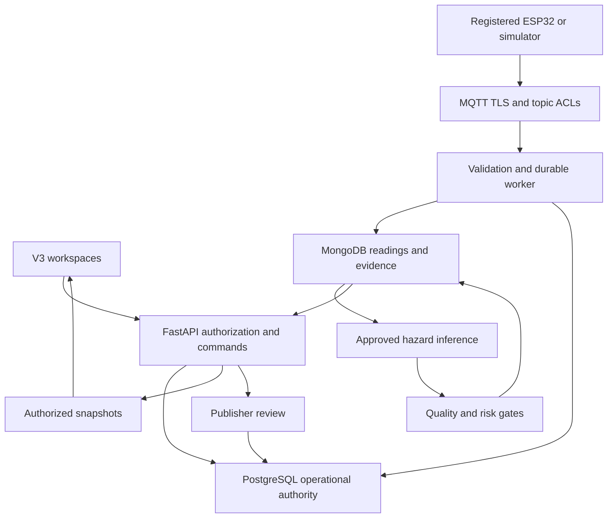
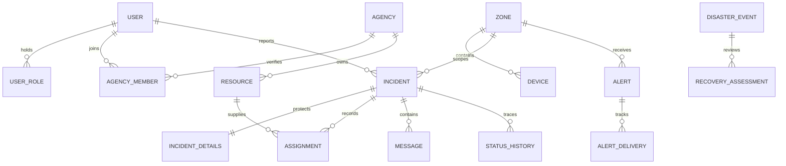

# Permanent V3 implementation reference
## Authority and decisions
`master-blueprint.md` is preserved verbatim and remains the product authority. Blueprint requirements are distinct from implementation choices: React/Vite + TypeScript, FastAPI, Supabase/PostgreSQL/PostGIS, MongoDB, MQTT and separate hazard models follow the approved foundation. MapLibre/OSM raster, Recharts, browser demo storage, SQL outbox/job queue and TLS health starter are implementation choices. Netlify/Render configurations preserve the proposed production path; the private review site hosts the frontend simulation only.

## Product and navigation
Public `/` is the RESQGRID INDIA landing and three-role demo login entry; `/warnings` exposes published demonstration warnings. Citizen `/me`, `/sos`, `/me/requests/:incidentId`, `/me/messages`, `/shelters`, `/help`; authentication entry `/auth`. Rescue `/operations`, `/operations/incidents`, `/operations/map`, `/operations/resources`, `/operations/coordination`, `/operations/shelters`, `/operations/recovery`. Intelligence `/intelligence`, `/intelligence/zones`, `/intelligence/hazards/:hazard`, `/intelligence/warnings`, `/intelligence/devices`, `/intelligence/models`, `/intelligence/history`. Administration `/admin` holds verification, risk rule controls, integrations and audit. Review Citizen routes require a demo citizen or admin session; Operations requires agency or admin; Intelligence and Administration require admin. These are client-side demonstration guards using a shared public demo password, not live authentication. Production must attach server-derived route capabilities and API authorization.

Citizen experience emphasizes readable warnings, short SOS steps, confirmation and an honest dispatch status. Operators see prioritized incident queues, suitable resources, assignment history and ownership. Intelligence exposes input quality, persistence/support gates, model readiness, risk provenance and human approval. Admin distinguishes role grants from verified agency membership. Recovery records reviewed findings tied to zones/events; analysis never claims automated satellite damage detection.

## Ownership and service boundaries
One frontend, one API and one worker keep the system simple. The API owns operational commands, JWT verification, current roles, scoped precise-location access, validation, audit, optimistic concurrency and notifications. PostgreSQL is authoritative for identities/capabilities, agency verification, zones, incidents, assignments, messages, resources, shelters, warnings, recovery, jobs and the transactional outbox. MongoDB owns raw readings, health, model outputs, risk evidence and archived events; it never owns citizen identity/location or operational assignment authority. Broker identities are provisioned per device and restricted by topic ACL.

Devices → authenticated MQTT/TLS → registry/topic/time/unit validation → Mongo unique reading → PostgreSQL unique job → timestamp-bounded feature window → checksum-verified approved artifact → prediction → quality/confidence/persistence/support/risk gates → review candidate → authorized publisher → durable warning/outbox → authorized snapshots. Delivery adapters and receipts remain pending. The worker may create evidence but cannot publish warnings or read citizen details. Human publication is never bypassed by a sensor spike.

## Contracts and states
Generated JSON schemas in `contracts/` document telemetry, health, prediction, risk event, warning, SOS, agency, resource, shelter, incident, assignment, transition and message. Stable `message_id` distinguishes replay from new observations; `source_mode` prevents simulated data becoming operational evidence; observed/received timestamps distinguish measurement age from transport lag. Measurements require units, sensor identity and rainfall window. Prediction probability refers to a defined target/horizon; confidence is separately named and may be unavailable. Unknown data does not establish safety.

Incident states: New → Acknowledged → Assigned → En route → On scene → Resolved → Closed (assignment may directly follow New); resource assignment is atomic and version checked. Duplicate submission with the same body returns the same incident; changed content under the same key conflicts. Exactly one active lead assignment is allowed; support coordination needs separate authorized grants before live implementation. Alerts: Draft → Published or Retracted; publication requires expiry and fresh hardware evidence matching zone, hazard and severity. Public responses omit private evidence pointers and citizen data.

## Realtime and failure behavior
Database notification is a wake-up signal, not durable evidence or delivery acknowledgement. Worker jobs/outbox records survive restarts; Mongo message and prediction IDs are unique. WebSocket first message carries the bearer token (not a query-string token), Origin is checked, roles/membership/expiry are rechecked before every snapshot. Server queues coalesce repeated wakes and send an authoritative scoped snapshot on connect or after up to 25 seconds. Multi-process wake-ups use PostgreSQL LISTEN/NOTIFY. Client reconnect/backoff and offline synchronization remain acceptance work. No cross-database distributed transaction is assumed: a retained MQTT message is reprocessed after a partial write, with stable IDs and unique jobs preventing duplicate work. Disaster risk models currently have no active artifacts, so inference jobs remain blocked instead of generating fake probabilities.

## Ambiguities requiring external decisions
SIH judging rules, pilot geography and authority, device part numbers/wiring/calibration, label definitions and forecast horizons, dataset rights/representativeness, per-hazard confidence validation, thresholds and response escalation, precise-location retention, multi-agency membership selection, supported languages, SMS/email/push providers, shelter data update authority, approved emergency phone numbers, imagery licenses and operational SLAs are not established by the blueprint alone. Their placeholders must remain explicit. Prototype risk weights/boundaries are not a validated operational policy.

## Architecture diagram

## Operational data model

Mongo relationships use stable source IDs: reading → prediction → risk event → warning evidence pointer. Citizen precise geography is held only in protected `incident_details`; zone geometry and provisioned device geography use PostGIS. Cross-store foreign keys are enforced by services, not claimed as database constraints.
